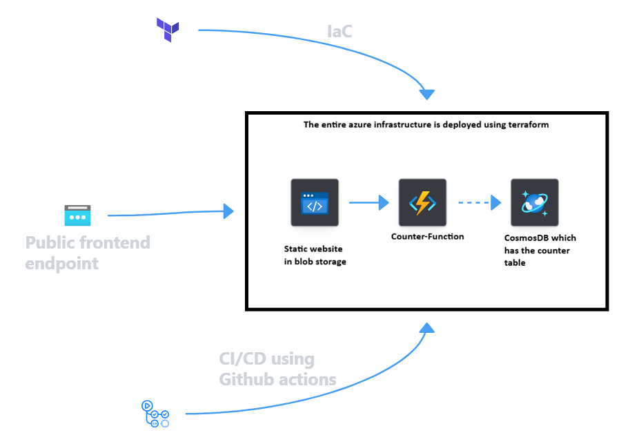

# Cloud-Resume-Challenge
My own version of the Cloud Resume Challenge implementation on Azure
This is what i followed haha!!!!
[text](https://cloudresumechallenge.dev/docs/the-challenge/azure/)
This is a statically hosted resume site backed by a serverless FastAPI visitor counter, fully provisioned with Terraform and deployed via GitHub Actions.

## Architecture
 


---
 
## Tech Stack
 
| Layer | Tooling |
|---|---|
| Frontend | HTML, CSS, JS |
| Backend | Python, FastAPI , Azure Functions |
| Database | Azure Cosmos DB (Table API) |
| Hosting | Azure Storage static website |
| IaC | Terraform |
| CI/CD | GitHub Actions (OIDC federated auth) |
| Testing | pytest, ruff |
 
---

## How It Works
 
### Frontend
A single static page . On load, calls the Function App's `/visitors-count` endpoint and renders the result into the page.
 
### Backend
`backend/app.py` defines a FastAPI app with two routes:
- `GET /` — health check message
- `GET /visitors-count` — increments and returns the visitor count, stored in a Cosmos DB Table API table. Falls back to an in-memory counter if no `CONNECTION_STRING` is configured (used for local dev and tests).
`backend/function_app.py` wraps the FastAPI app as an Azure Function using `func.AsgiFunctionApp`, so the same code runs locally (`uvicorn`) or inside Azure Functions.
 
### Infrastructure
Two Terraform stacks, run in order:
1. **`terraform-bootstrap`** — provisions the resource group, storage account, and `tfstate` blob container used as the remote backend for the main stack. Run once, manually.
2. **`terraform-config`** — provisions:
   - A storage account configured for static website hosting, with the frontend files uploaded as blobs
   - A Cosmos DB account (Table API) with the `VisitorCounter` table
   - A Linux Function App (consumption plan) running the Python backend, wired to the Cosmos connection string via app settings
   - Another storage account which acts as a remote backend which stores the tfstate file for terraform

### CI/CD
- **`ci.yml`** (on pull request): installs dependencies, lints with `ruff`, runs the pytest suite with coverage, and validates/formats the Terraform config — without touching real infrastructure.
- **`cd.yml`** (on push to `main`): authenticates to Azure via OIDC (no stored client secrets), runs `terraform plan` → `apply`, deploys the Function App code, and syncs the frontend files to the `$web` container.
---
# Running Locally
 
```bash
cd backend
pip install -r requirements.txt
uvicorn app:api --reload
```
 
By default (no `CONNECTION_STRING` set) the visitor counter uses an in-memory fallback, so no Azure resources are required for local development.
 
Run tests:
```bash
pytest backend/ --cov=backend
```
 

## Deploying
 
```bash
# One-time setup of the Terraform backend
cd terraform-bootstrap
terraform init
terraform apply
 
# Main infrastructure + app
cd ../terraform-config
terraform init
terraform plan
terraform apply
```
In normal operation, deployment is handled automatically by `cd.yml` on every push to `main`.
 
